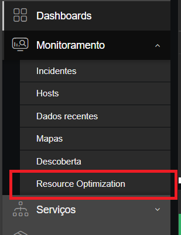
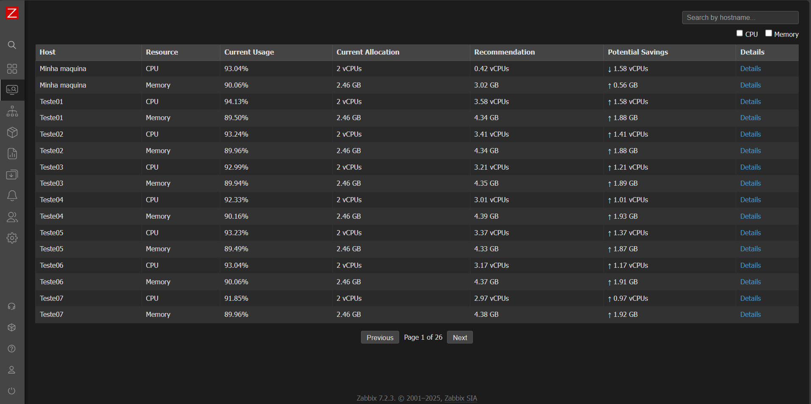
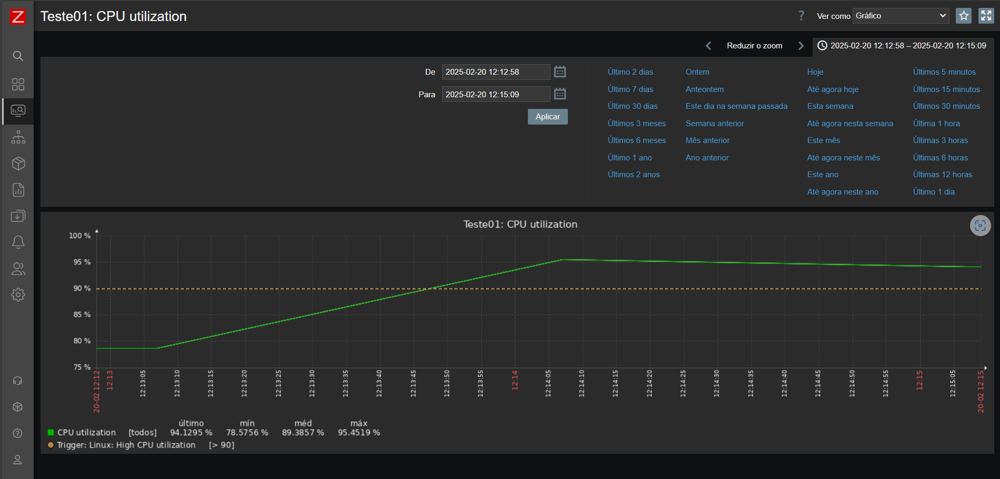
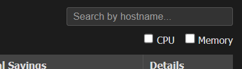
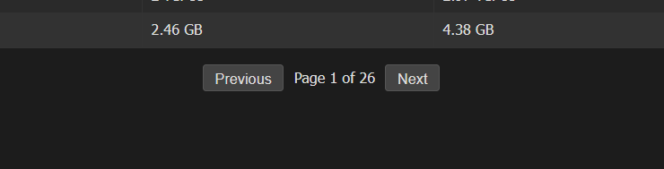

# Instalação de Módulo no Zabbix 7.2

Este guia explica como instalar um módulo no **Zabbix 7.2**.

## Requisitos

- Zabbix Server instalado e configurado

## Passo 1: Baixar o Módulo

1. Baixe o arquivo do módulo ResourceOptimization.

## Passo 2: Copiar o Módulo para o Diretório Correto

O local pode variar dependendo da versão:

- **7.2**: `/usr/share/zabbix/ui/modules`
- **Em outras**: você deve chegar na pasta modules em `/usr/share/zabbix`

Copie o módulo para a pasta modules

## Passo 3: Configurar o Zabbix

Acesse o Zabbix

- Acesse a interface web do Zabbix.
- Navegue até **Administração** > **Geral** > **Módulos**.
- Aperte em Diretõrio de digitalização, para adicionar o módulo ao Zabbix.
- Procure pelo módulo Resource Optimization.
- Ative o módulo.
- Atualize a página.

## Como usar

Ao ativar o módulo aparecerá uma nosa opção em Monitoramento da barra lateral.



Ao entrar na página do módulo ela estará assim se exisir host no grupo `SERVIDORES VIRTUAIS`.

### Obs: A primeira vez acessando pode demorar, depende de quantos hosts estão no grupo `SERVIDORES VIRTUAIS`.



Esta tabela irá mostrar dos dados de recursos utilizados por cada host (CPU e memória).

Em seguida mostrará uma sugestão de modificação do recurso, seja para aumentar ou diminuir o respectivo recurso.

Na ultima coluna tem a opção de visualizar o gráfico da utilização do recurso escolhido desse host, onde sejá aberto outra aba no navegador onde estará o gráfico.



Caso necessário você pode utilizar os filtros de busca seja por nome do host ou categoria.



Se a sua lista de hosts for muito extensa, será criado páginas nessa tabela até suprir a quantidade para mostrar todos os hosts. Você pode acessar essas páginas utilizando os botões que estão abaixo da tabela.



## Solução de Problemas

Pode ocorrer um problema para acessar a tabela em Details, para resolver basta modificar esse trecho do codigo em `views/resource.optimization.php`:


  ```bash
  detailsLink.href = "/history.php?action=showgraph&tab=" + encodeURIComponent(tabParam) +
                            "&itemids%5B%5D=" + encodeURIComponent(resourceItemid);
  ```

  por esse trecho:

  ```bash
  detailsLink.href = "/zabbix/history.php?action=showgraph&tab=" + encodeURIComponent(tabParam) +
                            "&itemids%5B%5D=" + encodeURIComponent(resourceItemid);
  ```

## Conclusão

Agora seu módulo está instalado e funcionando no Zabbix 7.2. Certifique-se de testar e validar seu funcionamento conforme a documentação do módulo. Se encontrar problemas, verifique os logs e a documentação do desenvolvedor.


